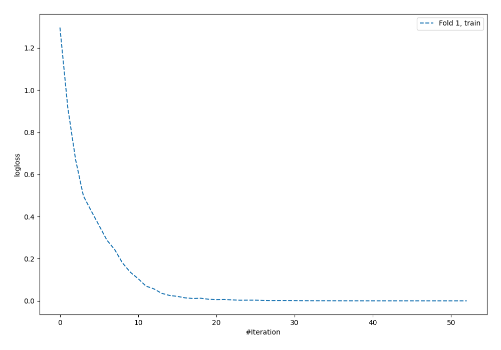
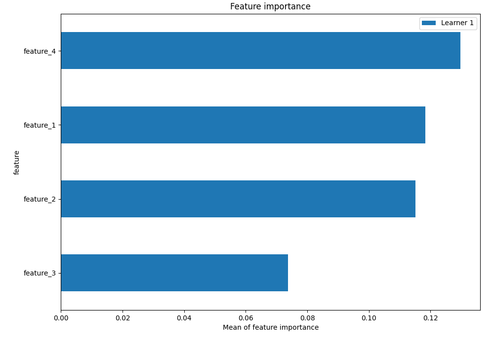
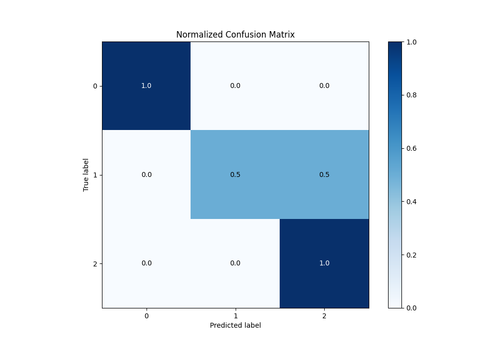
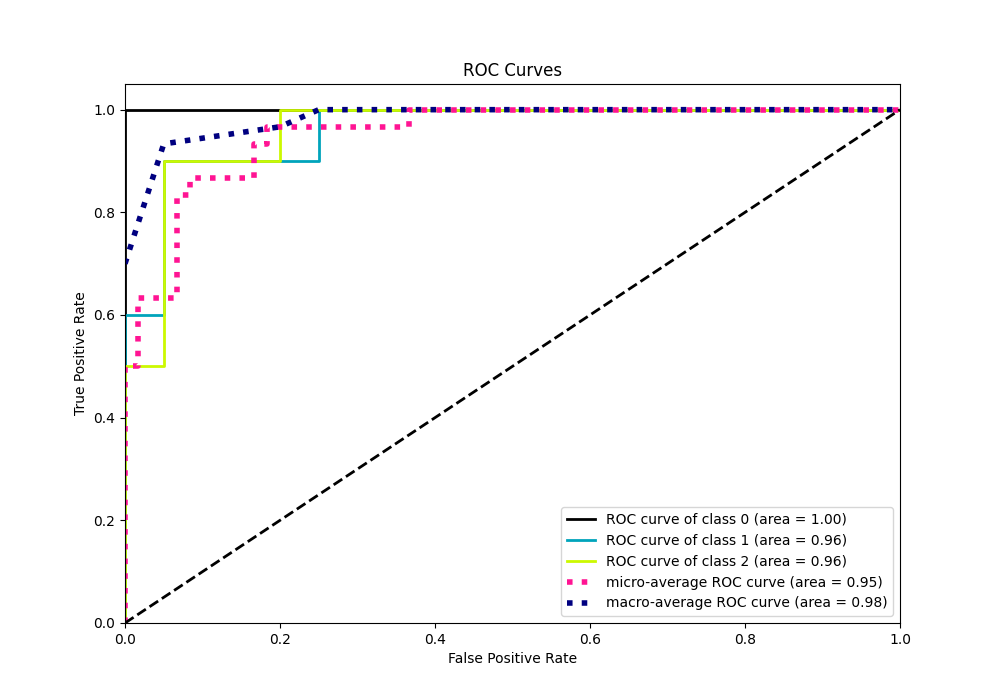
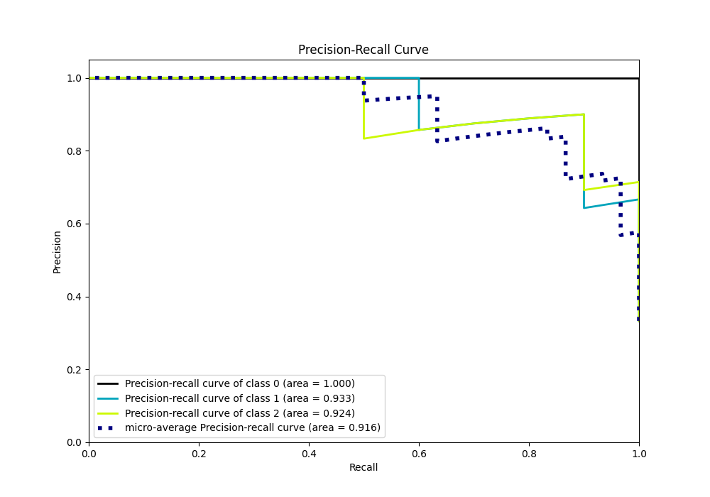

# Summary of 5_Default_NeuralNetwork

[<< Go back](../README.md)

## Neural Network
- **n_jobs**: -1
- **dense_1_size**: 32
- **dense_2_size**: 16
- **learning_rate**: 0.05
- **num_class**: 3
- **explain_level**: 2

## Validation
 - **validation_type**: split
 - **train_ratio**: 0.75
 - **shuffle**: True
 - **stratify**: True

## Optimized metric
logloss

## Training time

0.3 seconds

### Metric details
|           |   0 |         1 |         2 |   accuracy |   macro avg |   weighted avg |   logloss |
|:----------|----:|----------:|----------:|-----------:|------------:|---------------:|----------:|
| precision |   1 |  1        |  0.666667 |   0.833333 |    0.888889 |       0.888889 |   0.68277 |
| recall    |   1 |  0.5      |  1        |   0.833333 |    0.833333 |       0.833333 |   0.68277 |
| f1-score  |   1 |  0.666667 |  0.8      |   0.833333 |    0.822222 |       0.822222 |   0.68277 |
| support   |  10 | 10        | 10        |   0.833333 |   30        |      30        |   0.68277 |

## Confusion matrix
|              |   Predicted as 0 |   Predicted as 1 |   Predicted as 2 |
|:-------------|-----------------:|-----------------:|-----------------:|
| Labeled as 0 |               10 |                0 |                0 |
| Labeled as 1 |                0 |                5 |                5 |
| Labeled as 2 |                0 |                0 |               10 |

## Learning curves

## Permutation-based Importance

## Confusion Matrix

## Normalized Confusion Matrix

## ROC Curve

## Precision Recall Curve

[<< Go back](../README.md)
