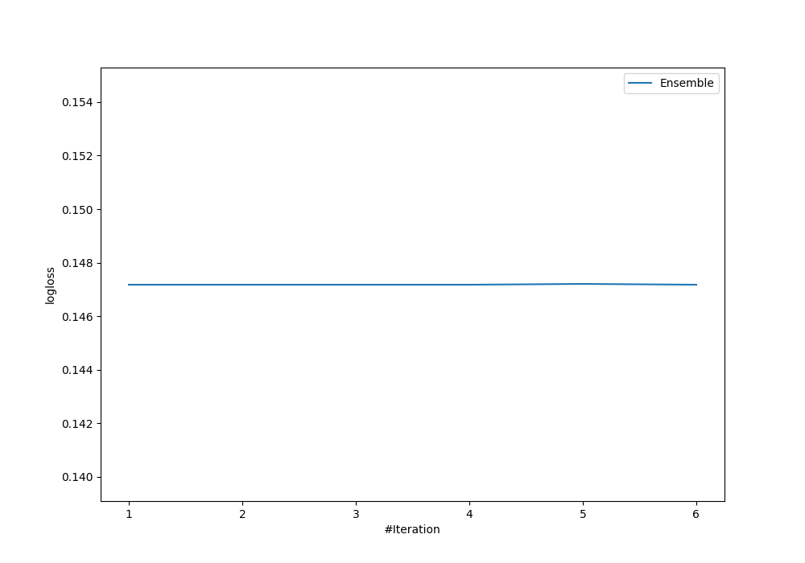
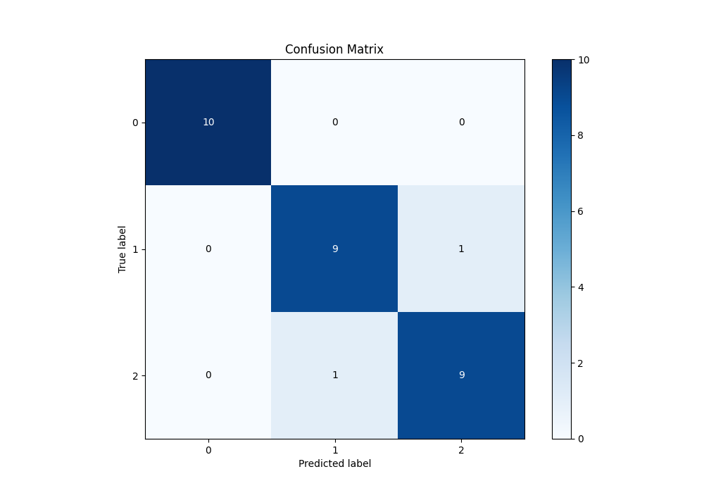
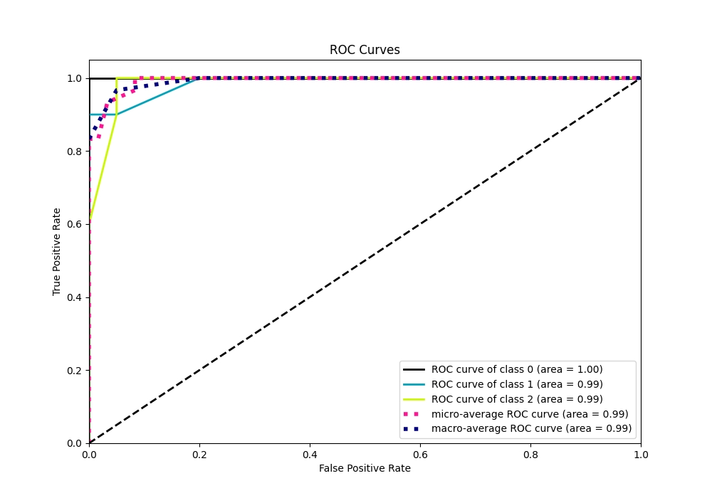
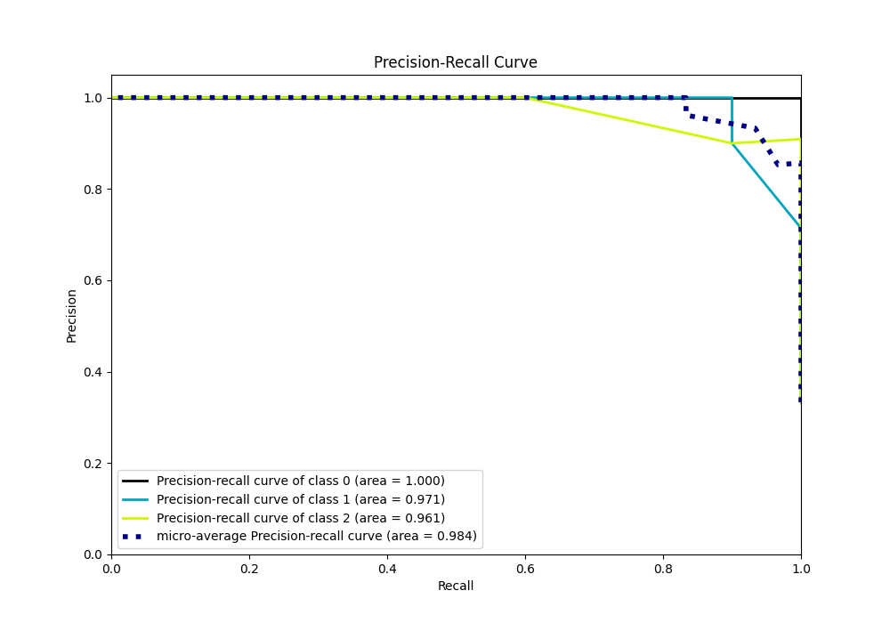

# Summary of Ensemble

[<< Go back](../README.md)

## Ensemble structure
| Model                  |   Weight |
|:-----------------------|---------:|
| 6_Default_RandomForest |        3 |

### Metric details
|           |   0 |    1 |    2 |   accuracy |   macro avg |   weighted avg |   logloss |
|:----------|----:|-----:|-----:|-----------:|------------:|---------------:|----------:|
| precision |   1 |  0.9 |  0.9 |   0.933333 |    0.933333 |       0.933333 |  0.147192 |
| recall    |   1 |  0.9 |  0.9 |   0.933333 |    0.933333 |       0.933333 |  0.147192 |
| f1-score  |   1 |  0.9 |  0.9 |   0.933333 |    0.933333 |       0.933333 |  0.147192 |
| support   |  10 | 10   | 10   |   0.933333 |   30        |      30        |  0.147192 |

## Confusion matrix
|              |   Predicted as 0 |   Predicted as 1 |   Predicted as 2 |
|:-------------|-----------------:|-----------------:|-----------------:|
| Labeled as 0 |               10 |                0 |                0 |
| Labeled as 1 |                0 |                9 |                1 |
| Labeled as 2 |                0 |                1 |                9 |

## Learning curves

## Confusion Matrix

## Normalized Confusion Matrix

## ROC Curve

## Precision Recall Curve

[<< Go back](../README.md)
